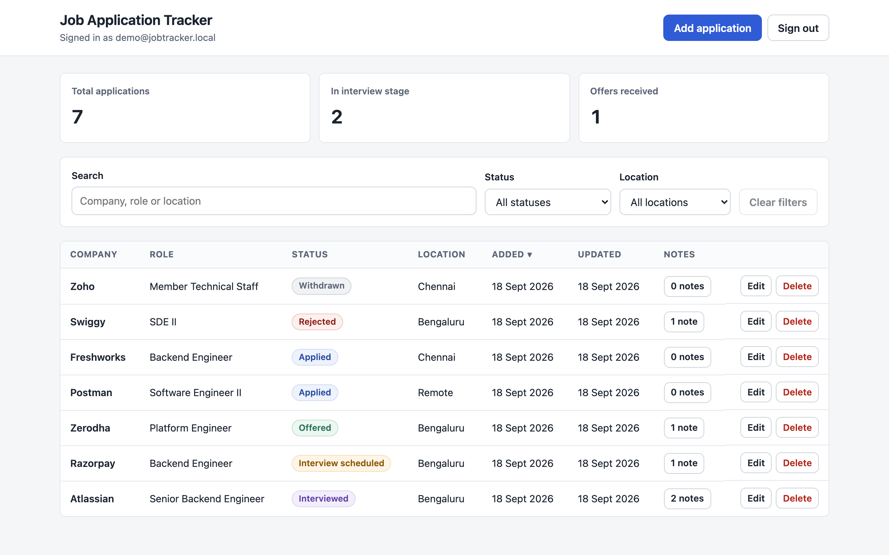
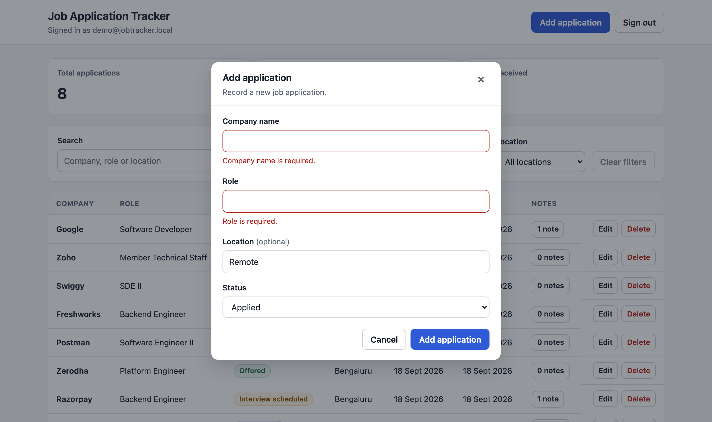

# Job Application Tracker — API

A Spring Boot REST API for tracking job applications and the notes attached to them.
Stateless JWT authentication, PostgreSQL persistence and versioned schema migrations
through Flyway.

This is the backend. The [web client](https://github.com/Anshika-320/job-application-tracker-fe)
is a React single-page app that consumes this API.



---

## Contents

- [Features](#features)
- [Tech stack](#tech-stack)
- [Prerequisites](#prerequisites)
- [Getting started](#getting-started)
- [Seeding demo data](#seeding-demo-data)
- [API reference](#api-reference)
- [Data model](#data-model)
- [Validation and error responses](#validation-and-error-responses)
- [Security](#security)
- [Testing](#testing)
- [Project structure](#project-structure)

---

## Features

- **JWT authentication** — stateless sessions, BCrypt password hashing, a filter that
  resolves the bearer token on every request
- **Application CRUD** — create, read, update and delete job applications with audit
  timestamps maintained by JPA lifecycle callbacks
- **Nested notes** — notes belong to an application and cascade on delete
- **Query routes** — filter by status, filter by location, search by company name,
  and a paged, sortable listing
- **Aggregation** — note counts per application in a single query
- **Bean validation** — request payloads are validated before reaching the service
  layer, with field-level error messages returned to the client
- **CORS** — an explicit allowlist driven by configuration, so a separately deployed
  frontend can call the API without weakening route authorization
- **Flyway migrations** — the schema is versioned and applied automatically at startup

---

## Tech stack

| Concern | Choice |
| --- | --- |
| Language | Java 17 |
| Framework | Spring Boot 4.1 |
| Security | Spring Security + JJWT |
| Persistence | Spring Data JPA / Hibernate |
| Database | PostgreSQL |
| Migrations | Flyway |
| Build | Maven (wrapper included) |
| Testing | JUnit 5, Spring MockMvc, Mockito |

---

## Prerequisites

Install these before running the project.

| Requirement | Version | Check with | Notes |
| --- | --- | --- | --- |
| **JDK** | 17 or newer | `java -version` | Any distribution — Temurin, Corretto, Zulu, Oracle |
| **PostgreSQL** | 13 or newer | `psql --version` | Server must be running and reachable |
| **Maven** | not required | `./mvnw -v` | The Maven wrapper is committed; it downloads Maven on first use |
| **curl** | any | `curl --version` | Only needed for `scripts/seed.sh`. Preinstalled on macOS and most Linux distributions |
| **Git** | any | `git --version` | To clone the repository |

Notes:

- The first build downloads Maven and the dependency tree, so it needs network access
  and takes a few minutes. Later builds are offline-capable.
- On macOS, PostgreSQL is easiest via [Postgres.app](https://postgresapp.com) or
  `brew install postgresql@16`. On Debian or Ubuntu, `sudo apt install postgresql`.
- No global Maven installation is needed. Use `./mvnw` on macOS and Linux, and
  `mvnw.cmd` on Windows.

---

## Getting started

### 1. Clone and create the database

```bash
git clone https://github.com/Anshika-320/job-application-tracker.git
cd job-application-tracker
createdb job_tracker
```

If `createdb` is not on your path, use `psql`:

```bash
psql -U postgres -c "CREATE DATABASE job_tracker;"
```

### 2. Configure the application

`src/main/resources/application.properties` is git-ignored so local credentials never
reach the repository. Copy the template and fill it in:

```bash
cp src/main/resources/application.properties.example src/main/resources/application.properties
```

| Setting | Purpose |
| --- | --- |
| `spring.datasource.url` | JDBC URL, e.g. `jdbc:postgresql://localhost:5432/job_tracker` |
| `spring.datasource.username` | Database user |
| `spring.datasource.password` | Database password |
| `jwt.secret` | Base64-encoded HMAC key, at least 256 bits |
| `jwt.expiration` | Token lifetime in milliseconds, e.g. `3600000` for one hour |
| `FRONTEND_ORIGIN` | Comma-separated browser origins allowed to call the API. Defaults to `http://localhost:5173` |

Generate a signing key:

```bash
openssl rand -base64 32
```

Every setting can also be supplied as an environment variable — `SPRING_DATASOURCE_URL`,
`JWT_SECRET`, `FRONTEND_ORIGIN` and so on — which is how you would configure a
deployed instance.

### 3. Create a sign-in account

There is no registration endpoint. The `dev` profile creates one account at startup
from environment variables:

```bash
SPRING_PROFILES_ACTIVE=dev \
TEST_USER_EMAIL=demo@jobtracker.local \
TEST_USER_PASSWORD='choose-a-local-password' \
./mvnw spring-boot:run
```

The log line `DEV LOGIN CHECK: SUCCESS` confirms the account was created and can
authenticate. Running the same command again updates that account's password rather
than creating a duplicate.

Without the `dev` profile the application starts normally and seeds nothing:

```bash
./mvnw spring-boot:run
```

The API listens on **http://localhost:8080**. Flyway applies the migrations in
`src/main/resources/db/migration` on the first run.

---

## Seeding demo data

`scripts/seed.sh` populates the database with a realistic dataset — seven
applications covering all six statuses, with notes attached to several of them.

With the API running under the `dev` profile as above:

```bash
TEST_USER_EMAIL=demo@jobtracker.local \
TEST_USER_PASSWORD='choose-a-local-password' \
./scripts/seed.sh
```

```
Job Application Tracker — seeding http://localhost:8080
  signed in as demo@jobtracker.local
  creating applications
  done - 7 applications in the database
```

| Option | Behaviour |
| --- | --- |
| *(none)* | Seeds only if the database has no applications, so it never overwrites your data |
| `--reset` | Deletes every existing application first, then seeds |
| `--help` | Usage information |

The script targets `http://localhost:8080` by default; override with `API_BASE_URL`.
It signs in through the real API, so it needs the account created in step 3 — if
sign-in fails it prints the exact command to start the API correctly.

---

## API reference

Every route except `/api/auth/**` requires an `Authorization: Bearer <token>` header.

### Authentication

| Method | Path | Body | Response |
| --- | --- | --- | --- |
| `POST` | `/api/auth/login` | `{ "email", "password" }` | `{ "token" }` |

```bash
curl -X POST http://localhost:8080/api/auth/login \
  -H 'Content-Type: application/json' \
  -d '{"email":"demo@jobtracker.local","password":"choose-a-local-password"}'
```

### Applications

| Method | Path | Notes |
| --- | --- | --- |
| `GET` | `/api/applications` | All applications |
| `POST` | `/api/applications` | Create — returns `201` |
| `GET` | `/api/applications/{id}` | Read one |
| `PUT` | `/api/applications/{id}` | Update |
| `DELETE` | `/api/applications/{id}` | Delete — returns `204` |
| `GET` | `/api/applications/status?status=` | Filter by status |
| `GET` | `/api/applications/search?companyName=` | Company name contains, case-insensitive |
| `GET` | `/api/applications/location?location=` | Exact location match, case-insensitive |
| `GET` | `/api/applications/page?page=&size=&sort=` | Paged and sorted listing |
| `GET` | `/api/applications/note-counts` | Note count per application |

### Notes

| Method | Path | Notes |
| --- | --- | --- |
| `GET` | `/api/applications/{id}/notes` | Notes for an application |
| `POST` | `/api/applications/{id}/notes` | Add a note — returns `201` |
| `DELETE` | `/api/applications/{id}/notes/{noteId}` | Delete a note — returns `204` |

### Request and response shapes

Creating or updating an application:

```json
{
  "companyName": "Atlassian",
  "role": "Senior Backend Engineer",
  "status": "INTERVIEWED",
  "location": "Bengaluru"
}
```

The response adds the identifier and audit timestamps:

```json
{
  "id": 1,
  "companyName": "Atlassian",
  "role": "Senior Backend Engineer",
  "status": "INTERVIEWED",
  "location": "Bengaluru",
  "createdAt": "2026-09-18T12:39:52.194332",
  "updatedAt": "2026-09-18T12:39:52.194332"
}
```

`companyName`, `role` and `status` are required; `location` is optional.

### Status values

`APPLIED` · `INTERVIEW_SCHEDULED` · `INTERVIEWED` · `OFFERED` · `REJECTED` · `WITHDRAWN`

---

## Data model

```
app_users                job_applications                application_notes
──────────────           ────────────────────            ──────────────────────
id            PK         id                 PK           id                  PK
email         unique     company_name       <=150        content             <=500
password_hash            role               <=150        job_application_id  FK
created_at               status             <=30
updated_at               location           <=150
                         created_at
                         updated_at

                         job_applications 1 ──── * application_notes
                              (cascade on delete)
```

`app_users` backs authentication only; it has no relationship to the other tables.

Timestamps are maintained by `@PrePersist` and `@PreUpdate` callbacks. Deleting an
application removes its notes through both the JPA cascade and a database-level
`ON DELETE CASCADE`.

---

## Validation and error responses

Field validation failures return `400` with a map of field to message, which the
client renders against the matching input:

```json
{
  "companyName": "Company name is required",
  "role": "Role is required"
}
```

Not-found and bad-value failures return `400` or `404` with a description:

```json
{
  "timestamp": "2026-09-18T12:39:52.366464",
  "status": 404,
  "error": "Not Found",
  "message": "Job application not found with id: 999999"
}
```



Constraints mirror the database columns, so oversized input is rejected with a `400`
rather than failing at the persistence layer.

---

## Security

- Passwords are hashed with BCrypt and never returned by any endpoint
- Sessions are stateless — `SessionCreationPolicy.STATELESS`, no server-side session
- Every route except `/api/auth/**` requires authentication
- Invalid, malformed and expired tokens clear the security context and yield `401`
- CORS is an explicit origin allowlist from `FRONTEND_ORIGIN`, restricted to the
  methods and headers the client actually uses. Wildcards are not used
- `application.properties` and `.env` files are git-ignored

**Known limitation:** applications are not scoped per user. Every authenticated user
sees the same records, which suits the current single-user scope. Supporting multiple
independent users would require a `user_id` column on `job_applications` and
ownership checks in the service layer.

---

## Testing

```bash
./mvnw test
```

11 tests across three slices:

| Suite | Covers |
| --- | --- |
| `JobApplicationControllerTest` | Required-field validation, length limits, unknown status handling, successful creation |
| `ApplicationNoteControllerTest` | Blank, missing and oversized note content; successful creation |
| `SecurityConfigCorsTest` | Preflight from an allowed origin, rejection of an unknown origin, and that CORS does not bypass authentication |

Build a runnable jar:

```bash
./mvnw package
java -jar target/job-tracker-0.0.1-SNAPSHOT.jar
```

---

## Project structure

```
src/main/java/com/anu/job_tracker/
  config/
    SecurityConfig.java        filter chain, CORS, password encoder
    DevTestUserConfig.java     dev-profile account seeding
  controller/                  REST endpoints
  dto/                         request and response payloads
  entity/                      JPA entities
  exception/                   ResourceNotFoundException and the global handler
  repository/                  Spring Data repositories
  security/                    JWT service, authentication filter, user details
  service/                     business logic
src/main/resources/
  db/migration/                Flyway migrations, V1 to V5
scripts/
  seed.sh                      demo data seeding
```
